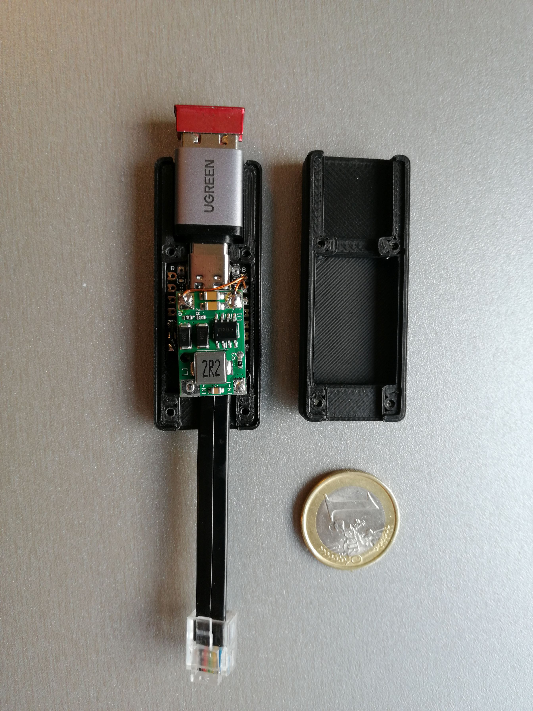
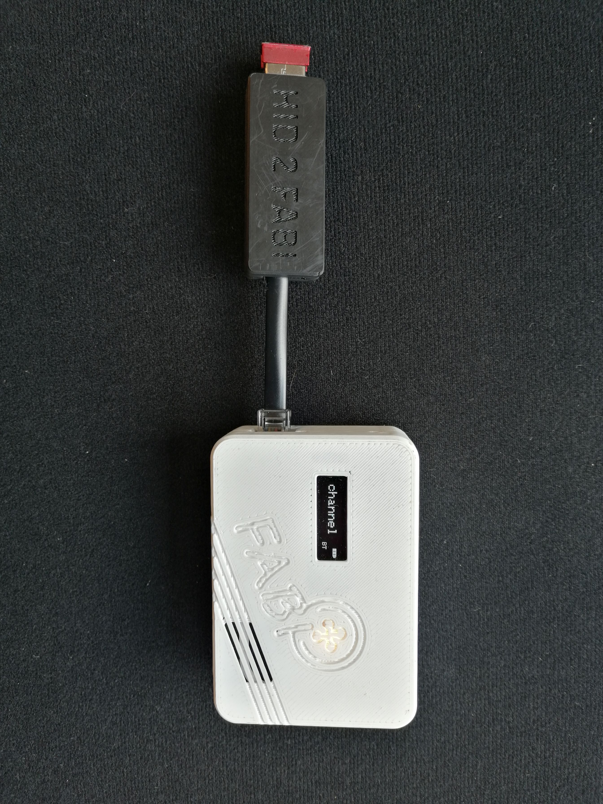

# HID-to-FABI Adapter 

This adapter allows the connection of USB HID mouse and gamepad devices to the Flexible Assistive Button Interface 
([FABI](https://github.com/asterics/FABI). Using FABI, standard or special assistive USB mouse or joysticks can 
be remapped to other functions including Bluetooth (BLE) mouse, keyboard and gamepad. 
Furthermore, the standard USB HID devices can be used to control special features like infrared remote control.

## Requirements

* for building the sofware, install VSCode/PlatformIO, clone or download this repository, add the folder to the PlatformIO workspace and build the project
* connect a [XIAO ESP32-s3](https://www.reichelt.at/at/de/shop/produkt/xiao_esp32s3_dual-core_wifi_bt5_0_mit_header-406872) or compatible microcontroller and upload (flash) the firmware binary
* connect a RJ25 cable to the microcontoller (starting from Pin1 of the cable): SCL (D5) , SDA (D4), GND, VCC (3.3V). See also [XIAO pinout](https://wiki.seeedstudio.com/xiao_esp32s3_getting_started/)
* in order to provide 5V supply to the XIAO microcontroller and the connected USB HID devices, add a small boost converter which steps up 3.3V to 5V.
  a possible converter see [here](https://www.aliexpress.com/p/tesla-landing/index.html?scenario=c_ppc_item_bridge&productId=1005001573130706).     
* for printing the enclosure, stl files are provided in the hw folder                                                  

## Usage

* connect the HID2Fabi adapter to a FABI device using the RJ25 extension port
* connect a USB OTG (Host) adapter to the XIAO (e.g. [this model](https://www.amazon.de/UGREEN-Adapter-Stecker-Handy-OTG-Adapter-kompatibel-GRAU/dp/B0B9N3QSL3) which fits into the suggested enclosure)
* connect a USB HID mouse or joystick 
* configure the FABI functions as desired using the [FABI WebGUI](https://fabi.asterics-foundation.org)
  * mouse x/y movement or joystick axis 1 x/y movement are converted to x/y sensor values or the FABI
  * mouse button 1/2/3 and joystick buttons 1-3 are converted to FABI buttons 1-3
  * mouse scroll wheel up/down movements are converted to FABI buttons 4 and 5
  
## Fotos

 
 # Acknowledgement
This work has been accomplished at the UAS Technikum Wien in course of the R&D-project [InDiKo](https://www.technikum-wien.at/en/research-projects/indiko/) (MA23 project 38-09), which is supported by the [City of Vienna](https://www.wien.gv.at/kontakte/ma23/index.html).
